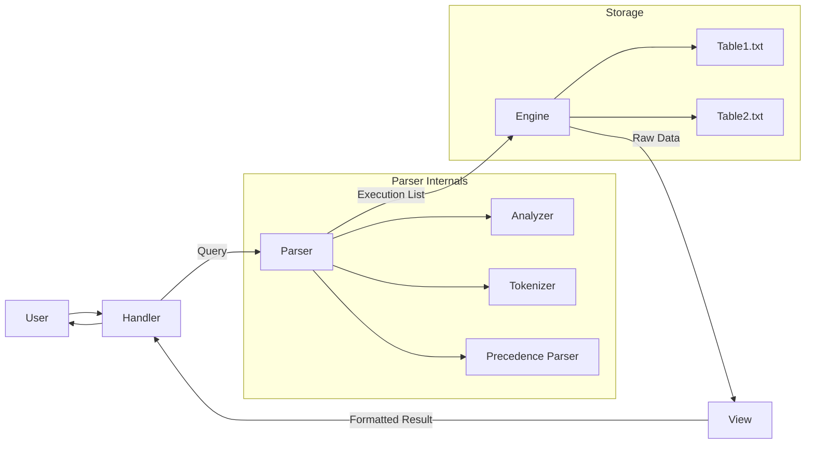

# Introduction

experimental DBMS for academic purposes with slight interest in microkernel architecture written in python.

This project will have a simple storage engine, query parser, transaction manager and a indexing system and other parts specified in [Structure](#structure).

# Structure

```
[Handler] ---> [Parser]
    ^                 \
     \                 \
      \                 \
       \                 \
        \                 v
        [View]<---------[Engine] <----> [Indexing]

```



As it can be seen a cyclical structure which move around [Handler](#handler) which handles user requests
and [Engine] that writes and reads data onto storage.

# Handler

Handler is the part that is responsible for receiving, processing, and responding to user requests. and presenting responses and results accoring to structures of view module.

# Parser

[parser.md](./src/parser/parser.md)

# Engine

# View
