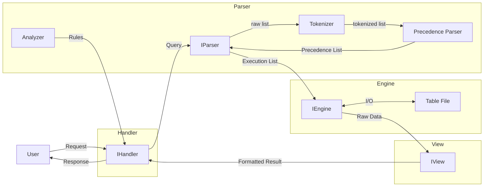
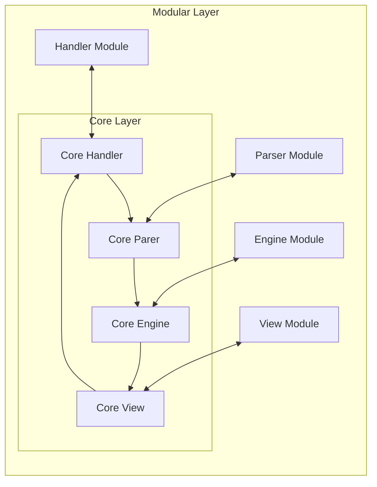

# blankDB: A Modular Database with Extensible Architecture

**Academic Project | Focused on Separation of Concerns and Plugin Architecture**

## Introduction

`blankDB` is a **research-focused SQL database** with Plug-in Architecture (micro-kernel Architecture) and its core innovation is a rigorously modular design with clean component separation and non hot-swappable plugins, providing an ideal platform for database systems experimentation.

This project is written in **plain python**. More details in [Structure](#structure).

## Structure

<!-- docs/diagram/Architecture.mmd -->

As it can be seen in this simple life cycle, the main components are:

- [Handler](#handler) which handles user requests.
- [Parser](#parser) which turns query into execution list (list with execution orders).
- [Engine](#engine) which writes and reads data onto storage.
- [View](#view) that takes raw data and turn it into representable output.

these are the core components of the program.

Each of the **modular parts** get accessed through their corresponding component in the **Core**.

<!-- docs/diagram/cor_modular_layers.mmd -->

<!-- usual database parts -->

<!-- why it doesnt have optimizer and storage -->

# Handler

Handler is the part that is responsible for receiving, processing, and responding to user requests. and presenting responses and results accoring to structures of view module.

# Parser

<!-- dont forget to tell its naive parser again -->

[parser.md](./src/parser/parser.md)

# Engine

# View
