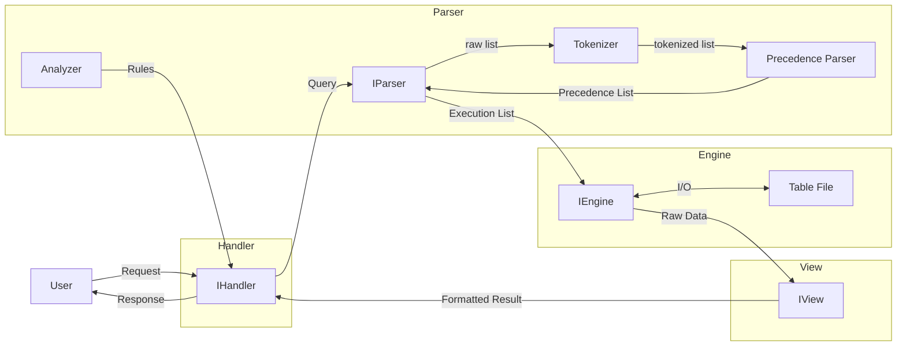

# blankDB: A Modular Database with Extensible Architecture

**Academic Project | Focused on Separation of Concerns and Plugin Architecture**

## Introduction

`blankDB` is a **research-focused SQL database** designed to demonstrate . Thanks to Plug-in Architecture (micro-kernel Architecture) its core innovation is a rigorously modular design with clean component separation and hot-swappable plugins, providing an ideal platform for database systems experimentation.

This project is written in plain python. More details in [Structure](#structure).

## Structure

<!-- docs/diagram/Architecture.mmd -->

As it can be seen a cyclical structure which move around [Handler](#handler) which handles user requests
and [Engine] that writes and reads data onto storage.

# Handler

Handler is the part that is responsible for receiving, processing, and responding to user requests. and presenting responses and results accoring to structures of view module.

# Parser

[parser.md](./src/parser/parser.md)

# Engine

# View
