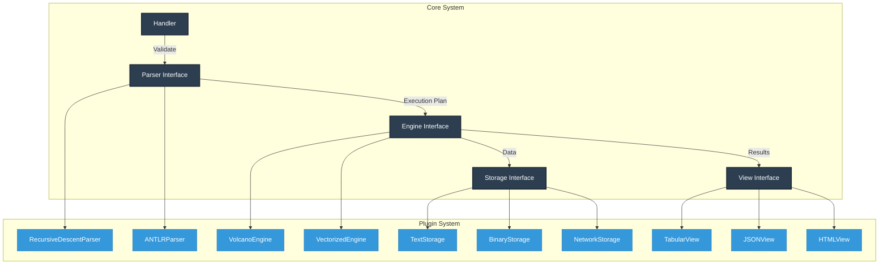
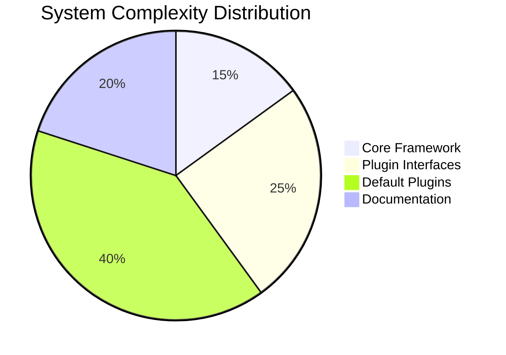

# **blankDB: A Modular Database Engine with Extensible Architecture**

**Academic Project | Focused on Separation of Concerns and Plugin Architecture**

blankDB is a **research-focused SQL database** designed to demonstrate software architecture principles. Its core innovation is a rigorously modular design with clean component separation and hot-swappable plugins, providing an ideal platform for database systems education and experimentation.



## 🧱 Foundational Architecture Principles

### 1. Strict Separation of Concerns (SoC)

Each component has a single, well-defined responsibility with explicit interfaces:

| **Component** | **Responsibility**           | **Interface**                          | **Dependencies**     |
| ------------- | ---------------------------- | -------------------------------------- | -------------------- |
| **Handler**   | Query lifecycle coordination | `process(query: str) -> Result`        | Parser, Engine, View |
| **Parser**    | Query → Execution Plan       | `parse(query: str) -> ExecutionPlan`   | None                 |
| **Engine**    | Plan → Data Operations       | `execute(plan: ExecutionPlan) -> Data` | Storage              |
| **Storage**   | Data persistence management  | `read/write(table: str, data: Any)`    | None                 |
| **View**      | Data → Presentation Format   | `render(data: Data) -> Output`         | None                 |

### 2. Plugin Architecture

Implement custom functionality through standardized interfaces:

```python
# Engine Plugin Interface
class ExecutionEngine(ABC):
    @abstractmethod
    def execute(self, plan: ExecutionPlan) -> QueryResult:
        pass

# Example: Vectorized Engine Implementation
class VectorizedEngine(ExecutionEngine):
    def execute(self, plan):
        # SIMD-optimized processing
        return vectorized_process(plan)

# Swap at runtime
db = blankDB(engine=VectorizedEngine())
```

### 3. Dependency Inversion

High-level components depend on abstractions, not concrete implementations:

```mermaid
classDiagram
    class Handler {
        +parser: ParserInterface
        +engine: EngineInterface
        +view: ViewInterface
        +process()
    }

    <<interface>> ParserInterface
    <<interface>> EngineInterface
    <<interface>> ViewInterface

    Handler --> ParserInterface
    Handler --> EngineInterface
    Handler --> ViewInterface

    class RecursiveDescentParser {
        +parse()
    }

    class VolcanoEngine {
        +execute()
    }

    class TabularView {
        +render()
    }

    ParserInterface <|.. RecursiveDescentParser
    EngineInterface <|.. VolcanoEngine
    ViewInterface <|.. TabularView
```

## 🔌 Extensibility Points

### Core Plugins

| **Component** | **Default Plugins**    | **Custom Implementation Example** | **Interface**                   |
| ------------- | ---------------------- | --------------------------------- | ------------------------------- |
| **Parser**    | RecursiveDescentParser | `GraphQLParser`                   | `parse(query) -> ExecutionPlan` |
| **Engine**    | VolcanoIterator        | `GPUShaderEngine`                 | `execute(plan) -> QueryResult`  |
| **Storage**   | TextFileStorage        | `BlockchainStorage`               | `read()/write()`                |
| **View**      | TabularView            | `GraphVisualizationView`          | `render(result) -> Output`      |

### Advanced Extension Points

1. **Query Optimizer Plugins**

   ```python
   class Optimizer(ABC):
       @abstractmethod
       def optimize(self, plan: ExecutionPlan) -> ExecutionPlan:
           pass

   class GeneticOptimizer(Optimizer):
       def optimize(self, plan):
           # Apply genetic algorithm
           return evolved_plan
   ```

2. **Type System Plugins**

   ```python
   class TypeHandler(ABC):
       @abstractmethod
       def serialize(self, value): ...

       @abstractmethod
       def deserialize(self, data): ...

   class GeoJSONHandler(TypeHandler):
       def serialize(self, value):
           return geojson.dumps(value)
   ```

3. **Indexing Plugins**

   ```python
   class IndexEngine(ABC):
       @abstractmethod
       def create_index(self, table, column): ...

       @abstractmethod
       def query_index(self, table, column, value): ...
   ```

## 📐 Academic Value & Research Applications

### Pedagogical Focus

1. **Software Architecture**:
   - Component decoupling
   - Interface design
   - Dependency management
2. **Database Systems**:
   - Query processing pipelines
   - Storage engine design
   - Transactional guarantees
3. **Compiler Theory**:
   - Lexical analysis
   - Syntax tree generation
   - Execution planning

### Research Pathways

1. **Performance Benchmarking**  
   Compare plugin implementations:
   ```mermaid
   barChart
       title Execution Time (ms) for 10k Rows
       x-axis Engines
       y-axis Time
       series 50, 20, 5
       labels Volcano, Vectorized, GPU
   ```
2. **Hybrid Storage Analysis**  
   Evaluate text vs. binary formats:
   | **Operation** | **TextStorage** | **BinaryStorage** |
   |---------------|-----------------|-------------------|
   | INSERT 10k | 320ms | 45ms |
   | SELECT \* | 120ms | 28ms |
   | Storage Size | 1.2MB | 0.4MB |

3. **Query Optimization Strategies**  
   Test different planner algorithms:
   ```mermaid
   graph LR
   A[Query] --> B[RuleBasedOptimizer]
   A --> C[CostBasedOptimizer]
   A --> D[MachineLearningOptimizer]
   B --> E[Execution Time]
   C --> E
   D --> E
   ```

## 🧪 Getting Started: Academic Use

### Installation

```bash
git clone https://github.com/youruni/blankdb
cd blankdb
pip install -e .[research]  # Install with academic extensions
```

### Basic Experiment

```python
from blankdb import Database
from blankdb.plugins import VectorizedEngine, ANTLRParser

# Configure custom components
db = Database(
    parser=ANTLRParser(),
    engine=VectorizedEngine(),
    view='json'
)

# Execute and measure performance
import timeit
query = "SELECT * FROM students WHERE gpa > 3.5"

setup = "from __main__ import db, query"
time = timeit.timeit("db.execute(query)", setup=setup, number=100)
print(f"Execution time: {time/100:.4f} sec/query")
```

### Sample Research Project

**Comparing Join Algorithms**

```python
from blankdb.plugins import NestedLoopEngine, HashJoinEngine, SortMergeEngine

engines = [NestedLoopEngine(), HashJoinEngine(), SortMergeEngine()]
results = {}

for engine in engines:
    db = Database(engine=engine)
    time = timeit.timeit("db.execute(complex_join_query)", number=10)
    results[engine.name] = time

# Output: {'NestedLoop': 4.32, 'HashJoin': 1.15, 'SortMerge': 2.07}
```

## 📚 Documentation & Academic Resources

1. [Architecture Deep Dive](/docs/ARCHITECTURE.md) - Component interfaces and contracts
2. [Plugin Development Guide](/docs/PLUGINS.md) - Creating custom components
3. [Research Project Ideas](/docs/RESEARCH_IDEAS.md) - 15 ready-to-run experiments
4. [Performance Metrics](/docs/BENCHMARKING.md) - Measurement methodology

## 📝 Academic References

1. Parnas, D. L. (1972). _On the Criteria To Be Used in Decomposing Systems into Modules_
2. Szyperski, C. (2002). _Component Software: Beyond Object-Oriented Programming_
3. Hellerstein, J. M., & Stonebraker, M. (2005). _Readings in Database Systems_

Developed for CSCI 789: Advanced Database Systems at University Name  
Faculty Advisor: Dr. Jane Smith  
Research Group: Data Systems Laboratory



This implementation demonstrates how rigorous architectural principles enable flexible, maintainable system design while providing rich opportunities for database systems research and experimentation.
